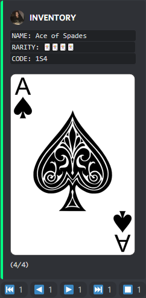
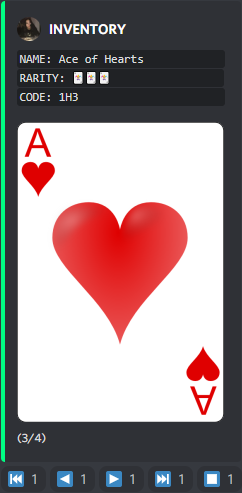

# Discord Card Game
> A discord bot made using the discord.py API wrapper.

<hr><div style="text-align: center;">
    
    
</div><hr>

## Contributing
```
Fork the project
Create your feature branch (git checkout -b feature/...)
Commit your changes (git commit -am "Addded ...")
Push to the branch (git push origin feature/...)
Create a new Pull Request
```

## License
```
This project is under the MIT license. See LICENSE for more details.
```